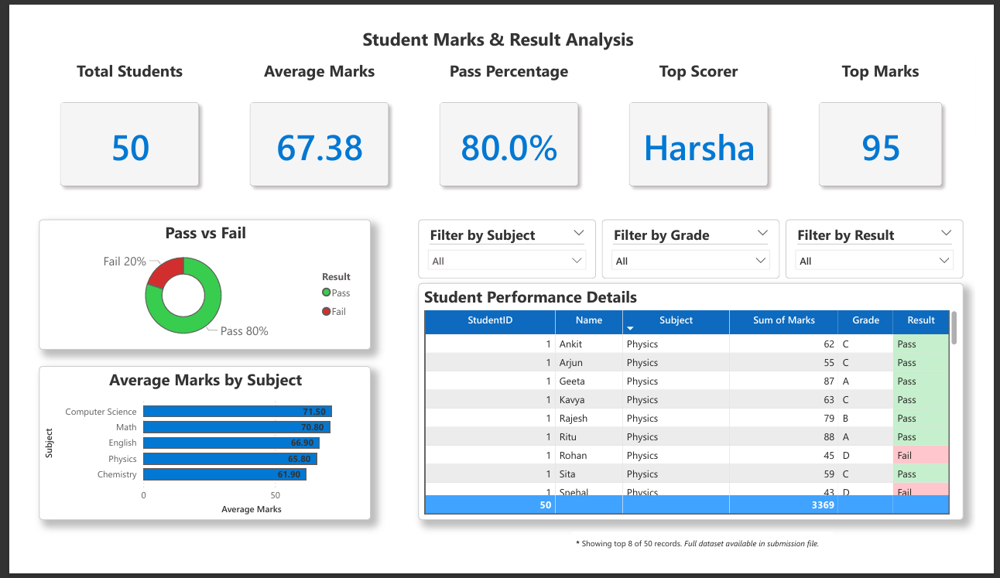
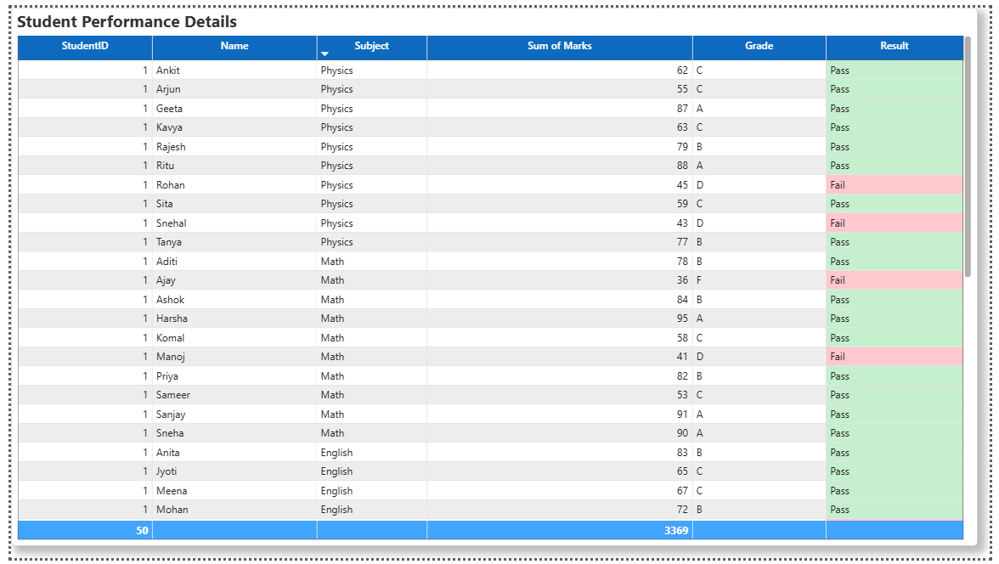
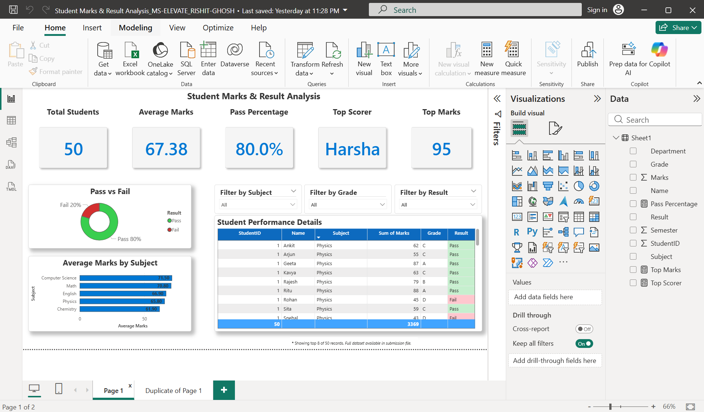

# 🎓 Student Performance Dashboard - [POWER-BI]

## 📌 Project Overview
This Power BI dashboard analyzes student marks, grades, and results across subjects. Built for the **MS Elevate Internship Capstone**, it provides interactive insights into academic performance using slicers, charts, and conditional formatting.

---

## 🧩 Problem Statement
Educational institutions often lack a consolidated, visual system to analyze student performance across subjects and grades. Manual tracking is inefficient and fails to highlight trends, top performers, or pass/fail ratios effectively.

---

## 💡 Proposed Solution
An interactive Power BI dashboard that:
- Visualizes student marks and result distribution
- Highlights top scorer and subject-wise averages
- Enables filtering by subject, grade, and result
- Applies conditional formatting for clarity

---

## 🛠️ Tech Stack
- **Power BI Desktop** - [Click here to Download](https://www.microsoft.com/en-us/power-platform/products/power-bi/downloads) 
- **Excel** (data source) - [Click here to Download](https://www.microsoft.com/en-in/microsoft-365/excel) 
- **DAX** (for calculated measures and formatting)

---

## Key Features
-  Total Students: `50`  
-  Average Marks: `67.38`  
-  Pass Percentage: `80%`  
-  Top Scorer: `Harsha` (95 marks)  
-  Subject-wise averages (bar chart)  
-  Pass vs Fail distribution (pie chart)  
-  Slicers for Subject, Grade, and Result  
-  Conditional formatting on Result and Grade columns  
>  Table view with scroll note: *“Showing top 8 of 50 records. Full dataset available in submission file.” [Click here to access](datasets/Student-Marks_Result-Analysis_Dataset.xlsx)*

---

## Screenshots

### 🔹 Full Dashboard Overview


### 🔹 Table View (Student Performance Details)


### 🔹 Power BI Canvas


---

## 📂 Repository Structure
```
student-performance-dashboard/
│── README.md
│── Student Marks - Result Analysis Dataset.xlsx
│── Student Marks - Result Analysis Dataset Visualization.pbix
│── Student Marks - Result Analysis Dataset Visualization.pdf
│── presentation/
│   └── MS_Elevate_Project-Student_Marks_Result_Analysis-RishitGhosh.pptx
└── screenshots/
    ├── dashboard_overview.png
    ├── table_view.png
    └── power-bi-dashboard.png
```

---

## Future Scope
- Add semester and department filters
- Integrate attendance and internal assessments
- Deploy via Power BI Service for web access
- Expand to predictive analytics (e.g., pass likelihood)

---

## Acknowledgements
Developed by **RISHIT GHOSH**  
B.Tech CSE – AI & ML, Geethanjali College of Engineering and Technology  
For **MS Elevate Internship – Capstone Project**  
Check out my Portfolio [here](https://rajghosh06-dev.github.io/portfolio/index.html).

---
## 🔗 References
- [Power BI Documentation](https://learn.microsoft.com/en-us/power-bi/)  
- [Microsoft Learn – Data Visualization](https://learn.microsoft.com/en-us/training/modules/introduction-power-bi/)  

>**NOTE:** The Dataset used for this Project was not taken from any other source. 

---
